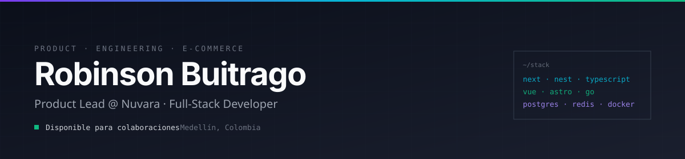

<div align="center">



<br/>

[](https://www.linkedin.com/in/robinson-buitrago-loaiza-3678b81b0/)
[](mailto:buitragorobinson33@gmail.com)
[](https://nuvara.com.co)

</div>

<br/>

## &nbsp;Sobre mí

> Lidero producto en **[Nuvara](https://nuvara.com.co)**, donde combino visión de producto con desarrollo full-stack.

Mi día a día se reparte entre definir hacia dónde va el producto y construir lo que lo lleva ahí — con énfasis en **frontend**, pero sin perderle el rastro al backend. Disfruto los problemas que cruzan disciplinas: **arquitectura, UX, performance y decisiones de negocio**.

Trabajo principalmente en **e-commerce, SaaS y herramientas internas** para equipos que necesitan moverse rápido sin romper cosas.

<br/>

## &nbsp;Stack

<table>
  <tr>
    <td valign="top" width="25%">
      <h4>&nbsp;Frontend</h4>
      <p>
        <br/>
        <br/>
        <br/>
        <br/>
        <br/>
        
      </p>
    </td>
    <td valign="top" width="25%">
      <h4>&nbsp;Backend</h4>
      <p>
        <br/>
        <br/>
        <br/>
        <br/>
        <br/>
        
      </p>
    </td>
    <td valign="top" width="25%">
      <h4>&nbsp;E-commerce</h4>
      <p>
        <br/>
        <br/>
        <br/>
        
      </p>
    </td>
    <td valign="top" width="25%">
      <h4>&nbsp;Tooling</h4>
      <p>
        <br/>
        <br/>
        <br/>
        <br/>
        <br/>
        
      </p>
    </td>
  </tr>
</table>

<br/>

## &nbsp;Proyectos destacados

<table>
  <tr>
    <td width="50%" valign="top">
      <h3>&nbsp;Axioma POS &nbsp;<sub><sup>🚀 PRODUCTO PROPIO</sup></sub></h3>
      <p><sub><b>SAAS · PLATAFORMA POS · MONOREPO</b></sub></p>
      <p>
        Producto SaaS propio de punto de venta que diseño, lidero y construyo
        end-to-end. Monorepo con panel web, API de negocio, agente de impresión,
        facturación electrónica DIAN, landing de pricing y un CLI propio
        para acelerar el desarrollo del equipo.
      </p>
      <p>
        <code>Next.js 15</code>&nbsp;<code>React 19</code>&nbsp;<code>NestJS</code>&nbsp;<code>Drizzle</code>&nbsp;<code>PostgreSQL</code>&nbsp;<code>Redis</code>&nbsp;<code>BullMQ</code>&nbsp;<code>Go</code>&nbsp;<code>Turborepo</code>&nbsp;<code>Docker</code>
      </p>
    </td>
    <td width="50%" valign="top">
      <h3>&nbsp;<a href="https://github.com/RobinsonBui/vertice">Vértice Contable</a></h3>
      <p><sub><b>SITIO INSTITUCIONAL · CLIENTE</b></sub></p>
      <p>
        Sitio oficial de Vertice Contable SAS. Performance-first, SSG con Astro,
        diseño responsivo y optimizado para SEO.
      </p>
      <p>
        <code>Astro</code>&nbsp;<code>TypeScript</code>&nbsp;<code>SCSS</code>
      </p>
    </td>
  </tr>
</table>

<br/>

## &nbsp;Filosofía

```
"Construir software es 20% código y 80% decisiones.
 Las herramientas cambian; los fundamentos no."
```
<br/>

---
